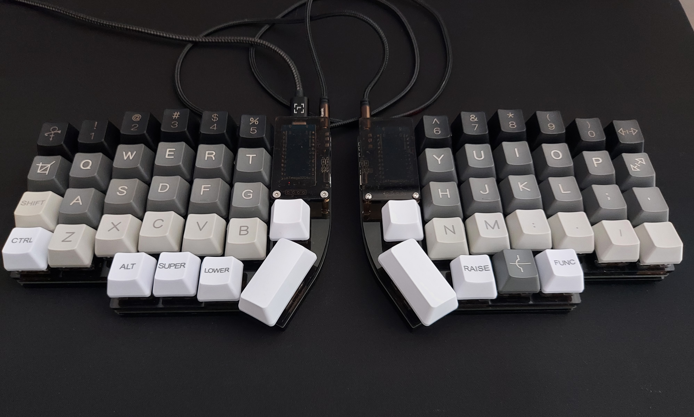
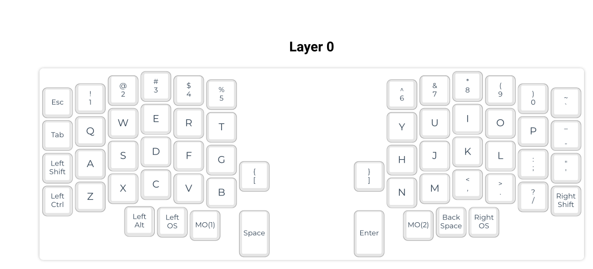
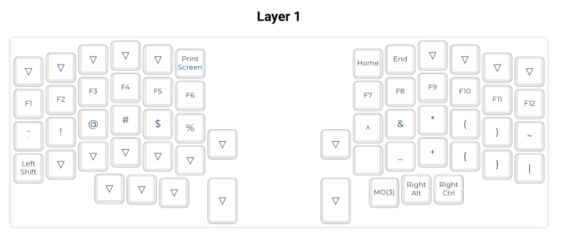
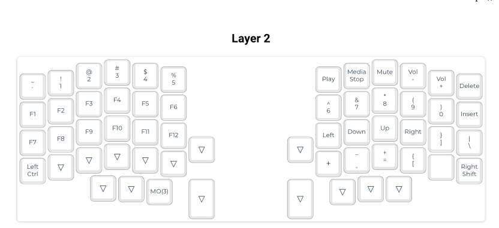

# lily0x: lily58 pro build


This is my custom lily58 pro build.



With the help of the [original](https://github.com/kata0510/Lily58/blob/master/Pro/Doc/buildguide_en.md) I managed to build this open source keyboard.

This repo is a fork of qmk_firmware with my custom layout added in the lily58 keymaps.

## Layouts

With the raise and lower keys, it's possible to have custom layers.

### Layout 0 



### Layout 1



### Layout 2




## Firmware 

Use the qmk configurator to create the layout. After that compile it and flash the firmware to the pro micro controllers.

```
qmk new-keymap
qmk config user.keyboard=lily58/rev1
qmk json2c -o keymap.c lily0xgui.json
qmk compile
qmk flash
```

Note: to put the microcontrollers into boot mode, click the reset button twice.
